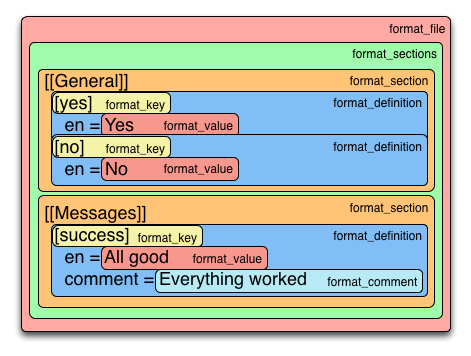
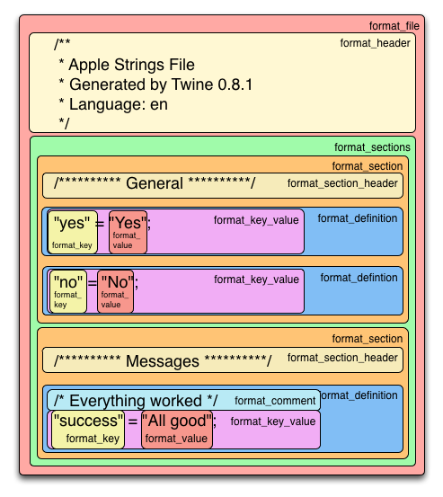

# How Formatters Work

It's a formatters job to transform a Twine file into a localization file of a specific format. That task is solved using a hierarchical approach. This document describes the process in detail using the following Twine file as an example.

```
[[General]]
	[yes]
		en = Yes
	[no]
		en = No

[[Messages]]
	[success]
		en = All good
		comment = Everything worked
```

A Twine file consists of multiple _sections_, each _section_ contains _keys_ with translated _values_, _comments_ and so on. If we highlight the components of the example file, it looks like this:


A formatter takes each of these components (and a few more) and formats them, working it's way from the outside inwards. First the method `format_file` is called, which doesn't do much more than calling `format_sections` which in turn calls `format_section` for each section and so on. To get an overview which method calls which, look at the next picture, where each method is represented by a block that is called by its surrounding block - read it from top to bottom and from the outside in.


If we map the _input_ for each method to the example file, it looks like this



As stated at the beginning, the output produced by a formatter depends on the formatter. The output of the Apple formatter would for example be

```
/**
 * Apple Strings File
 * Generated by Twine 0.8.1
 * Language: en
 */

/********** General **********/

"yes" = "Yes";

"no" = "No";


/********** Messages **********/

/* Everything worked */
"success" = "All good";
```

Or, highlighted by the method that produces each piece of the output



The process described above is implemented by the structure giving formatter base class [`Abstract`](/lib/twine/formatters/abstract.rb). To generate a desired output format, a formatter overwrites just enough methods to gain as much control as it needs - it's basically the [Template Method Pattern](https://en.wikipedia.org/wiki/Template_method_pattern) applied again and again.

# Write a Formatter

Formatters inherit from [`Abstract`](/lib/twine/formatters/abstract.rb) and need to specify some information about the format they are supporting like the format name, the default file name, if they can handle a directory of localization files and so on - just take a look at the class and the [other formatters](/lib/twine/formatters) to get an idea.

The `Abstract` formatter also specifies two utility methods to be used when read a localization file, `set_translation_for_key` and `set_comment_for_key`, however the actual parsing is too formatter specific and must be implemented in the `read` method of a formatter.

Which methods to overwrite to produce the desired output depends pretty much on the format. Again, looking at the [bundeled formatters](/lib/twine/formatters) will provide some insight.

Finally, to make a formatter available, it needs to be added to the list of formatters

```
Twine::Formatters.formatters << MyWickedFormatter.new
```

# Plugins

Once a formatter has been developed, it can be distributed as a gem and loaded as a plugin. Twine will read a yaml config file specifying which plugins to load from three locations.

0. `./twine.yml`    The current working directory
0. `~/.twine`       The home directory
0. `/etc/twine.yml` The etc directory

Plugins are specified as values for the `gems` key. The following is an example config:

```
gems: wicked_twine
```

Multiple gems can also be specfied in the yaml file.

```
gems: [wicked_twine, some_other_plugin]
```
